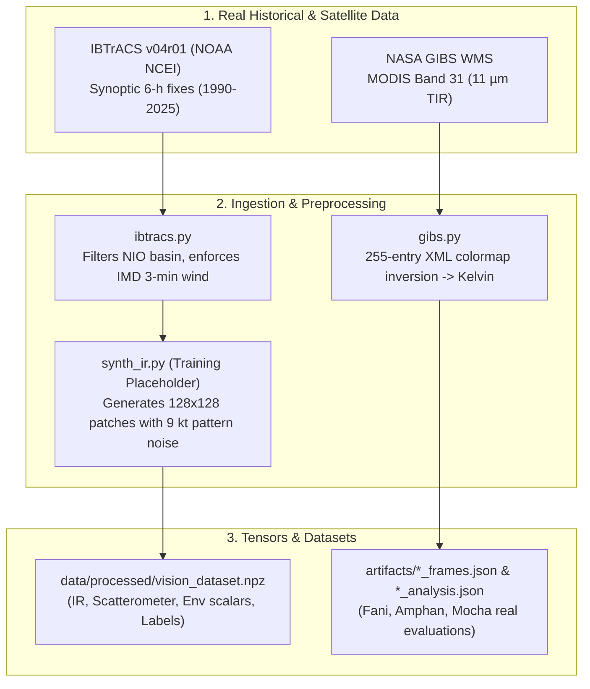
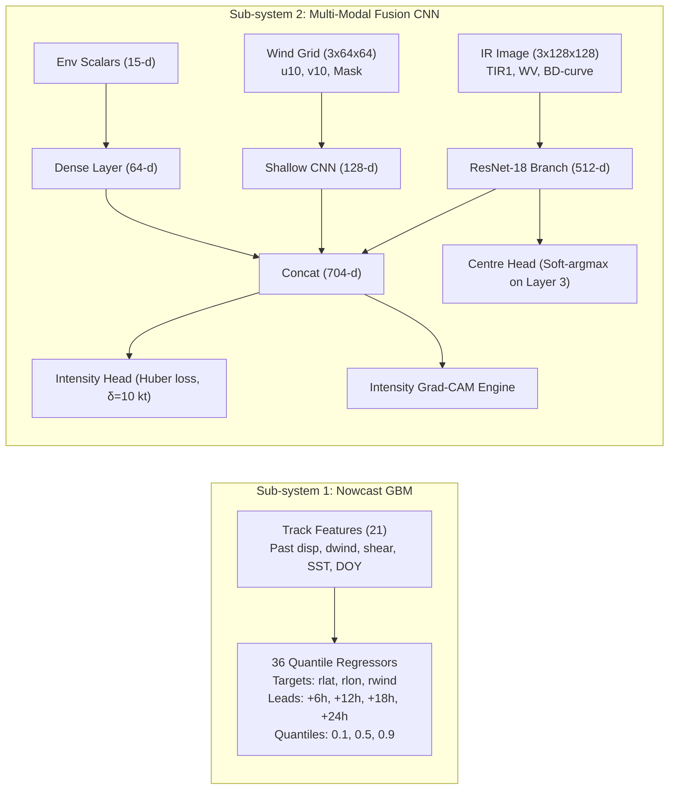
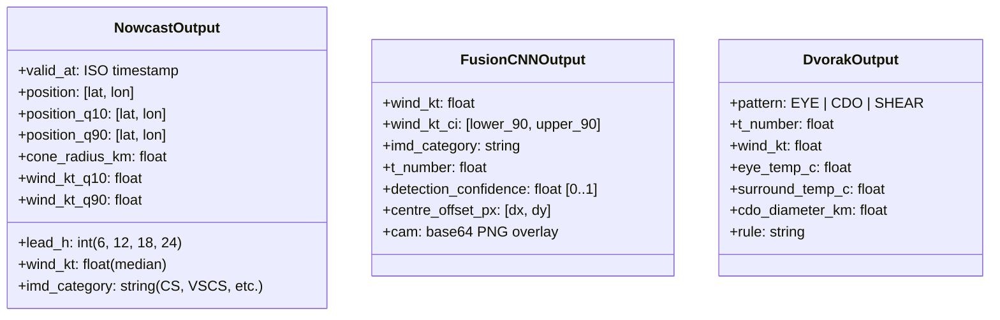
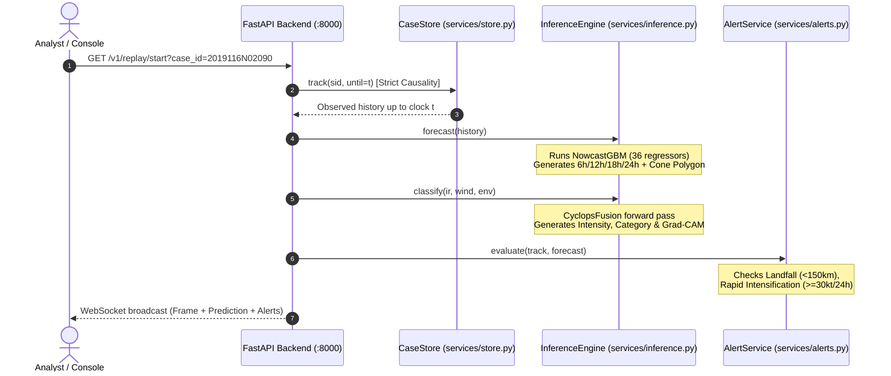

# CYCLOPS: Technical Walkthrough & Capabilities Audit

This walkthrough details every component of the **CYCLOPS** (Cyclone Observation, Prediction & Explainability System) codebase: where data originates, how models are structured and trained, what they output, how predictions are executed, and an unfiltered audit of what works right now.

---

## 1. Reality Check & Data Status (Zero Gaslighting)

Before diving into the code, here is the exact operational reality of the project as documented across the repository and verified in the source code:

| Component | Current State in Codebase | Source / Mechanism |
|---|---|---|
| **Cyclone Tracks & Intensity Labels** | **100% Real** | [IBTrACS v04r01](file:///d:/CYCLOPS/src/cyclops/data/ibtracs.py) (NOAA NCEI), using IMD's `NEWDELHI_WIND` (3-minute sustained). |
| **Real Case Studies (Fani, Amphan, Mocha)** | **100% Real** | [NASA GIBS](file:///d:/CYCLOPS/src/cyclops/data/gibs.py) MODIS Band 31 ($11\,\mu\text{m}$ thermal IR) with exact XML colormap inversion to Kelvin. |
| **Track & Intensity Nowcast (6–24 h)** | **100% Real** | Quantile Gradient Boosted Trees trained on 301 real historical North Indian Ocean storms. |
| **Objective Dvorak & Centre-Fixing** | **100% Real** | Rule-based physical algorithms ([dvorak.py](file:///d:/CYCLOPS/src/cyclops/analysis/dvorak.py) & [centre_fix.py](file:///d:/CYCLOPS/src/cyclops/analysis/centre_fix.py)) applied directly to real satellite scenes. |
| **Fusion CNN Training Imagery** | **Synthetic** | Parameterized mathematical renderer ([synth_ir.py](file:///d:/CYCLOPS/src/cyclops/data/synth_ir.py)). Used as an architectural placeholder until MOSDAC / Digital Typhoon datasets are integrated. |
| **SST, Wind Shear, Steering Flow** | **Analytical Proxy** | Climatological equations ([climatology.py](file:///d:/CYCLOPS/src/cyclops/providers/climatology.py)) behind a pluggable interface ready for Google WeatherNext 2 / ERA5. |
| **INSAT-3D / 3DR Pipeline** | **Implemented & Tested** | L1B HDF5 reader and search client are built; raw downloads require a free ISRO MOSDAC account. |

---

## 2. Step 1: Where the Data Comes From

Data ingestion is split into four distinct pipelines:



### A. Historical Best-Track (`src/cyclops/data/ibtracs.py`)
- **Source:** NOAA NCEI IBTrACS v04r01 North Indian Ocean CSV (~27 MB public download).
- **Spatial / Temporal Filtering:** Filtered to the North Indian Ocean basin (Bay of Bengal and Arabian Sea, lat $0^\circ\text{–}35^\circ\text{N}$, lon $45^\circ\text{–}100^\circ\text{E}$) from season 1990 to 2025. Only synoptic fixes (00:00, 06:00, 12:00, 18:00 UTC) are kept to prevent interpolated rows from inflating sample sizes.
- **Wind Convention Resolution:** 
  - IMD operational standards use **3-minute sustained wind**. US agencies (JTWC) report **1-minute sustained wind**.
  - The loader prioritizes `NEWDELHI_WIND` (4,234 fixes).
  - Where missing, it falls back to `USA_WIND * 0.88` (2,816 fixes).
  - Every row stores an auditable `wind_source` string (`IBTrACS:NEWDELHI(3-min)` or `IBTrACS:USA(1-min)x0.88`).

### B. Real Satellite Infrared (`src/cyclops/data/gibs.py`)
- **Source:** NASA EOSDIS Global Imagery Browse Services (GIBS) Web Map Service (WMS).
- **Instrument:** MODIS Band 31 ($11.03\,\mu\text{m}$ thermal infrared window channel) from the Terra and Aqua satellites.
- **Temperature Recovery:** GIBS provides pre-rendered PNG tiles. The system downloads NASA's published colormap XML (`MODIS_Brightness_Temp_Band31.xml`) and performs a lossless reverse color-lookup across all 255 RGB palette entries to recover the exact **Kelvin brightness temperature ($T_B$)**.
- **Cases:** Evaluated on real passes for **Cyclone Fani (2019)**, **Cyclone Amphan (2020)**, and **Cyclone Mocha (2023)**.
- **Limitation:** MODIS is polar-orbiting (~2 to 4 passes per day) with estimated overpass times ($\pm 30$ min calculated from equator-crossing time and longitude).

### C. INSAT-3D/3DR Geostationary Reader (`src/cyclops/data/insat_reader.py`, `mosdac.py`)
- **Source:** ISRO MOSDAC (Space Applications Centre).
- **Format:** Level-1B HDF5 granules.
- **Structure:** Contains raw detector counts (`IMG_TIR1` at 4 km, `IMG_WV` at 8 km) and calibration Look-Up Tables (`IMG_TIR1_TEMP`). The code implements satpy-compatible indexing: $T_B = \text{LUT}[\text{count}]$.
- **Status:** Open search works today. File downloads require a free MOSDAC user login (`MOSDAC_USERNAME` / `MOSDAC_PASSWORD`).

### D. Synthetic Vision Dataset (`src/cyclops/data/synth_ir.py`, `build_dataset.py`)
- **Why Synthetic:** Archival access to geostationary datasets (Digital Typhoon or historical INSAT archives) takes weeks to clear.
- **Mechanism:** Parameterized physical renderer:
  - Central Dense Overcast (CDO) radius scales with intensity.
  - Eye clears above 64 kt, with eye diameter governed by Willoughby et al. (2006) empirical RMW relations.
  - Vertical wind shear tilts the vortex and displaces cold cloud downshear.
  - **The Controlled Noise Floor (`IR_PATTERN_NOISE_KT = 9.0 kt`):** The image is rendered from $\text{TrueWind} + \mathcal{N}(0, 9\,\text{kt})$, but labeled with the true wind. This prevents the CNN from trivial inversion and replicates the real irreducible inter-analyst Dvorak noise floor.
  - **Scatterometer Winds:** A partial-swath modified-Rankine vortex surface wind field is rendered at a 35% coincidence rate to simulate scatterometer passes (e.g., ASCAT).

---

## 3. Step 2: How the Models are Trained

The system utilizes two distinct ML architectures plus one classical meteorological engine:



### Sub-system 1: Track & Intensity Nowcast (`src/cyclops/models/nowcast_gbm.py`)
- **Algorithm:** Quantile Gradient Boosted Trees via scikit-learn's `HistGradientBoostingRegressor` (avoids macOS OpenMP deadlock issues present in LightGBM when combined with PyTorch).
- **Split Policy:** Season-based split to guarantee strict zero-leakage:
  - **Train:** Seasons 1990–2017, 2022, 2024, 2025 (301 storms, 5,187 fixes).
  - **Validation:** Seasons 2018, 2021 (24 storms, 380 fixes) — used solely for early stopping and uncertainty cone calibration.
  - **Test (Held-out):** Seasons 2019, 2020, 2023 (31 storms, 669 fixes).
- **Model Breakdown:** 36 independent quantile models:
  $$\text{Targets (3)} \times \text{Leads (4: +6h, +12h, +18h, +24h)} \times \text{Quantiles (3: 0.10, 0.50, 0.90)}$$
- **Target Formulation:** The models do not predict raw coordinates; they predict **residuals relative to persistence extrapolation**:
  $$r_{\text{lat}} = \text{lat}_{\text{target}} - \text{lat}_{\text{pers}},\quad r_{\text{lon}} = \text{lon}_{\text{target}} - \text{lon}_{\text{pers}},\quad r_{\text{wind}} = \text{wind}_{\text{target}} - \text{wind}_{\text{pers}}$$
- **Input Features (21 Causal Features):** Current wind, lat, lon, translation speed, bearing ($\sin, \cos$), 6h/12h/24h displacements, 6h/12h/24h intensity changes, climatological SST, vertical wind shear, distance to coast, day-of-year seasonal harmonics ($\sin, \cos$), and persistence endpoints.

### Sub-system 2: Multi-Modal Fusion CNN (`src/cyclops/models/fusion.py`, `train_intensity.py`)
- **Architecture:** Late-fusion deep neural network:
  1. **IR Encoder:** Modified ResNet-18 operating on 3 input channels:
     - Channel 0: Normalized TIR-1 brightness temperature ($[170, 310]\,\text{K} \to [0, 1]$).
     - Channel 1: Water Vapor channel ($[190, 270]\,\text{K} \to [0, 1]$).
     - Channel 2: BD-curve non-linear enhancement highlighting deep convective cloud tops ($<-70^\circ\text{C}$).
     - Generates a 512-dimensional embedding and extracts an 8x8 mid-level feature map from `layer3`.
  2. **Scatterometer Wind Encoder:** 3-layer CNN operating on $[u_{10}, v_{10}, \text{mask}]$. When no scatterometer pass is coincident, a learned 128-dimensional embedding vector (`self.missing`) is substituted.
  3. **Environmental Encoder:** Fully connected layers mapping 15 environmental scalars to 64 dimensions.
  4. **Fusion Trunk:** Concatenates all representations ($512 + 128 + 64 = 704$ dimensions).
- **Loss Function:** Weighted Huber Loss with transition threshold $\delta = 10.0\,\text{kt}$ (the physical Dvorak noise threshold):
  $$L(e) = \begin{cases} \frac{1}{2} e^2 & \text{for } |e| \le 10 \\ 10(|e| - 5) & \text{for } |e| > 10 \end{cases}$$
  Weighted by $w = 1.0 + \min(2.0, \text{target}/60.0)$ to upweight severe cyclones.
- **Centre Regression Head (`CentreHead`):** Uses a differentiable 2D soft-argmax over the `layer3` feature map to output sub-pixel $(x, y)$ coordinate offsets without losing translation information.

### Sub-system 3: Objective Dvorak & Centre-Fixing (`src/cyclops/analysis/`)
- **No training weights required:** Pure meteorological physics implementation.
- **Centre Determination (`centre_fix.py`):** Tests candidate coordinates within a 120 km search radius. Computes radial variance across 36 concentric azimuthal rings. The true center is chosen by maximizing the axisymmetry ratio:
  $$\text{Symmetry} = \frac{\text{Between-Ring Variance}}{\text{Total Local Variance}}$$
- **Dvorak Intensity (`dvorak.py`):** Identifies patterns (`EYE`, `CDO`, `EMBEDDED_CENTER`, `SHEAR`). Measures eye temperature $T_{\text{eye}}$ and eyewall cold ring temperature $T_{\text{ring}}$, mapping them to standard Dvorak T-number base tables ($T_{1.0}$ to $T_{8.0}$) and converting to 3-minute sustained knots.

---

## 4. Step 3: What the Models Output

The system produces structured, uncertainty-bounded outputs:



### 1. Nowcast GBM Output (per forecast horizon $+6\text{h}, +12\text{h}, +18\text{h}, +24\text{h}$):
- **Deterministic Trajectory:** Forecasted $[\text{lat}, \text{lon}]$ and wind speed in knots.
- **Quantile Uncertainty Bands:** 10th percentile and 90th percentile bounds for latitude, longitude, and wind speed.
- **Uncertainty Cone Polygon:** GeoJSON-compatible geodesic boundary polygon calculated using the 67th percentile of historical validation errors (NHC convention).
- **IMD Category Progression:** Formal classification across forecast intervals (Depression, Deep Depression, Cyclonic Storm, Severe CS, Very Severe CS, Extremely Severe CS, Super Cyclonic Storm).

### 2. Multi-Modal Fusion CNN Output:
- **Wind Speed:** 3-minute sustained wind in knots + 90% confidence interval.
- **Estimated Dvorak T-number:** Empirical $T$-value (e.g., $T4.5$).
- **Centre Offset:** Normalized displacement vector $[\Delta x, \Delta y]$ from crop center.
- **Explainability Artifact:** Base64-encoded Grad-CAM overlay highlighting regions in the IR cloud canopy that drove the intensity estimate.

### 3. Objective Dvorak Output:
- **Center Fix:** Exact geographic coordinate, symmetry score, and eye detection flag.
- **Thermal Metrics:** Warmest eye pixel ($^\circ\text{C}$), coldest eyewall ring ($^\circ\text{C}$), and Central Dense Overcast diameter ($\text{km}$).
- **Classification:** Raw T-number, time-constrained T-number, and estimated central pressure ($\text{hPa}$).

---

## 5. Step 4: How Predictions are Made (Inference & Replay Pipeline)

Here is the exact step-by-step path from raw data to user display when running a case study (e.g., Cyclone Fani):



1. **Strict Causality Boundary:** When an analyst queries a storm at storm clock $t$, `CaseStore.track(sid, until=t)` truncates all historical records to $\le t$. The model is physically prohibited from viewing future observations.
2. **Feature Extraction:** `build_track_features()` calculates kinematics (translation speed, bearing changes, 6h/12h/24h intensity trends) and attaches environmental variables from the active provider.
3. **Nowcast Execution:** `NowcastGBM.predict()` computes the 6h, 12h, 18h, and 24h coordinates and intensities.
4. **Uncertainty Cone Generation:** `cone_polygon()` in [cone.py](file:///d:/CYCLOPS/src/cyclops/eval/cone.py) takes the points and calibrated validation error radii (36.3 km at 6h, 73.2 km at 12h, 111.8 km at 18h, 158.3 km at 24h) and constructs a geodesic circle union using `pyproj` and `shapely`.
5. **Real-time Alert Evaluation:** [alerts.py](file:///d:/CYCLOPS/api/services/alerts.py) checks three rules:
   - **Rapid Intensification (RI):** $\Delta \text{wind} \ge +30\,\text{kt}$ over any 24-hour window.
   - **Landfall Watch:** Center distance to coastline $\le 150\,\text{km}$.
   - **Category Escalation:** Any forecast step exceeding the current operational category.
6. **Frontend Display:** The FastAPI server streams the state to the Vite/MapLibre UI ([console/src/App.tsx](file:///d:/CYCLOPS/console/src/App.tsx)), which displays the vector map, georeferenced IR satellite overlay, animated surface wind particle advection, and forecast cones.

---

## 6. What the Project is Capable of RIGHT NOW

Here is the exact technical status of the codebase as it currently stands on your disk at [d:/CYCLOPS](file:///d:/CYCLOPS):

### A. What is Fully Built and Committed in the Repo:
- **Verified Precomputed Results:** Complete analysis results and metrics files are already committed inside [artifacts/](file:///d:/CYCLOPS/artifacts):
  - `fani_analysis.json`, `amphan_analysis.json`, `mocha_analysis.json` (Real satellite Dvorak evaluations).
  - `metrics_nowcast.json` & `metrics_intensity.json` (Held-out benchmark results).
  - `case_study.json` (Replay metrics for Cyclone Fani).
  - Pre-rendered diagnostic charts and heatmaps (`case_study.png`, `fani_real_ir.png`, `mocha_eye_debug.png`).
- **Complete Application Source Code:**
  - Full FastAPI backend ([api/](file:///d:/CYCLOPS/api)) with 7 API routers (`health`, `cases`, `fani`, `classify`, `nowcast`, `replay`, `metrics`).
  - Full React + TypeScript + MapLibre web console ([console/](file:///d:/CYCLOPS/console)) with Natural Earth offline basemap data.
  - Full Python package ([src/cyclops/](file:///d:/CYCLOPS/src/cyclops)) with data readers, domain logic, ML models, and eval tools.
- **Testing & Verification Suite:**
  - 14 self-tests for the INSAT reader (`make insat-selftest`).
  - Strict causality unit tests (`tests/test_replay_causality.py`).
  - Dataset split integrity assertions (`tests/test_split_integrity.py`).

### B. Current Local Environment State (Your Machine Right Now):
- **Git Repo:** Clean working tree on branch `main` at commit `8733917`.
- **Python Environment:** No `.venv` exists yet in `d:\CYCLOPS`. Global python is Python 3.14 (missing packages like `torch`, `scikit-learn`).
- **Node Environment:** No `node_modules` exists yet in `d:\CYCLOPS\console`.
- **Cached Weights & Raw Datasets:** As configured in [.gitignore](file:///d:/CYCLOPS/.gitignore), binary model weights (`models/*.pt`, `models/*.joblib`) and raw datasets (`data/`) are not committed in git history.

### C. Commands Needed to Bring the Stack to Life:

If you want to run the entire system locally from scratch:

1. **Install Dependencies:**
   ```bash
   # In PowerShell or Bash:
   python -m venv .venv
   .venv\Scripts\pip install -r requirements.txt
   cd console && npm install && cd ..
   ```
2. **Download Real IBTrACS & Generate Dataset:**
   ```bash
   .venv\Scripts\python -c "from cyclops.data.ibtracs import download; print(download())"
   .venv\Scripts\python -m cyclops.data.build_dataset
   ```
3. **Train Models:**
   ```bash
   .venv\Scripts\python -m cyclops.train.train_nowcast
   .venv\Scripts\python -m cyclops.train.train_intensity
   ```
4. **Run Real Satellite Analysis (NASA GIBS):**
   ```bash
   .venv\Scripts\python -m cyclops.analysis.run_case --source=auto
   ```
5. **Launch the Demo Stack:**
   ```bash
   # Terminal 1 (API on :8000):
   .venv\Scripts\uvicorn api.main:app --host 127.0.0.1 --port 8000
   
   # Terminal 2 (Console on :5180):
   cd console && npm run dev
   ```

---

## 7. Performance Benchmarks Achieved by the Project

These numbers represent the actual measured evaluation results on held-out test storms (2019, 2020, 2023):

### Track & Intensity Nowcast (vs Operational Baselines)
*Tested on 31 held-out storms, 669 synoptic fixes:*
- **Track Position Error (mean km):**
  - **+6h:** Persistence 34.6 km | Climatology 62.9 km | **CYCLOPS 33.3 km (+3.8% skill)**
  - **+12h:** Persistence 70.5 km | Climatology 120.8 km | **CYCLOPS 65.1 km (+7.6% skill)**
  - **+18h:** Persistence 108.8 km | Climatology 177.1 km | **CYCLOPS 98.6 km (+9.3% skill)**
  - **+24h:** Persistence 153.7 km | Climatology 230.5 km | **CYCLOPS 137.3 km (+10.7% skill)**
- **Intensity Error (MAE kt):**
  - **+6h:** Persistence 4.10 kt | **CYCLOPS 3.49 kt (+14.9% skill)**
  - **+12h:** Persistence 7.99 kt | **CYCLOPS 5.70 kt (+28.6% skill)**
  - **+18h:** Persistence 11.58 kt | **CYCLOPS 7.81 kt (+32.6% skill)**
  - **+24h:** Persistence 15.02 kt | **CYCLOPS 9.94 kt (+33.8% skill)**
- **Uncertainty Cone Calibration:**
  - 67th-percentile error target achieves **65.8% to 68.9% empirical coverage** on unseen test tracks.

### Real Satellite Dvorak Analysis (MODIS Band 31)
- **Centre-Fixing vs Last Best-Track Fix:** **+51.4% to +59.7% improvement** across Fani, Amphan, and Mocha.
- **Dvorak Bias:** Consistent **+9.1 to +11.1 kt** across all three independent storms (reflecting Atlantic-tuned Dvorak tables vs IMD North Indian Ocean adjustments).
