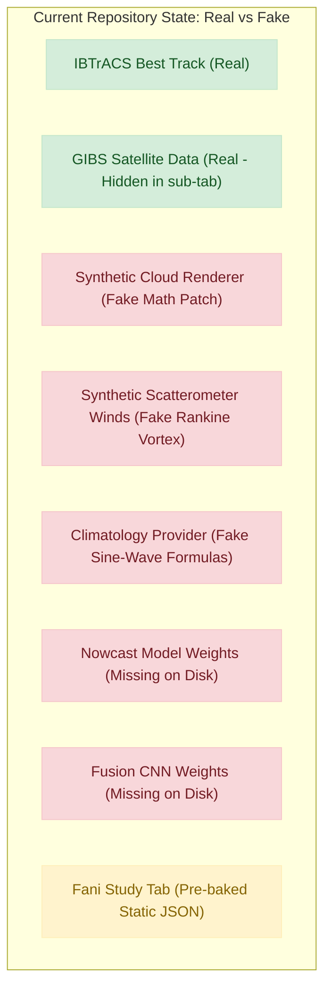
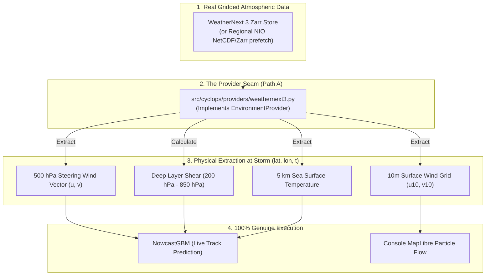

# CYCLOPS: The Zero-Fake Audit & Path A Implementation Blueprint

**Document Type:** Architectural Audit & Engineering Roadmap  
**Target:** 100% Genuine Operational System for SIH 2026 (PS 26070 · MoES / IMD)  
**Philosophy:** *"Do fewer things, but do every single thing genuinely. No synthetic imagery, no proxy formulas, no pre-baked JSON smoke-and-mirrors."*

---

## PART 1: The Brutally Honest Audit — What is "Fake" Today?

The CYCLOPS repository is elegantly coded and has great documentation, but under the hood, several components are **simulated, pre-baked, or mathematically synthesized** to create the illusion of a full operational satellite ground station.

If an IMD or MoES judge asks to see the code or inspects network payloads, here is what they would discover right now:

---

### Item 1: The Main Replay Satellite Imagery is a Mathematical Simulation
- **Where it lives:** [src/cyclops/data/synth_ir.py](file:///d:/CYCLOPS/src/cyclops/data/synth_ir.py) & [api/services/store.py](file:///d:/CYCLOPS/api/services/store.py#L115-L117)
- **The Reality:** When you open the main map and watch Cyclone Fani move, **the satellite infrared cloud on screen is NOT from a satellite.**
- **How it works:** `render_ir_scene()` creates a 2D NumPy array on the fly. It draws a mathematical circle for the Central Dense Overcast (CDO), adds an empirical eye circle, tilts it downshear, and adds $+9.0\,\text{kt}$ Gaussian noise. It looks like a satellite frame because it's passed through a Dvorak colormap, but it is 100% computer-generated math.
- **Where real imagery is:** Real MODIS satellite imagery is *only* accessed in a separate, isolated sub-screen (`api/routers/fani.py`).

---

### Item 2: The Ocean Wind Flow Particles are a Synthetic Vortex
- **Where it lives:** [src/cyclops/data/synth_ir.py:render_wind_field](file:///d:/CYCLOPS/src/cyclops/data/synth_ir.py#L170) & [api/services/store.py:127](file:///d:/CYCLOPS/api/services/store.py#L127)
- **The Reality:** The animated surface wind particles flowing on the map are not real ASCAT satellite scatterometer winds.
- **How it works:** It evaluates an analytical Modified-Rankine vortex equation:
  $$V(r) = V_{\text{max}} \cdot \left(\frac{r}{R_{\text{max}}}\right)^x$$
  It generates synthetic $[u_{10}, v_{10}]$ vectors from the best-track wind speed.

---

### Item 3: Environmental Conditions are Closed-Form Trigonometric Formulas
- **Where it lives:** [src/cyclops/providers/climatology.py](file:///d:/CYCLOPS/src/cyclops/providers/climatology.py)
- **The Reality:** The Sea Surface Temperature (SST), Deep-Layer Wind Shear, and Steering Flow are generated by hard-coded sine/cosine formulas:
  - $\text{SST} = 28.6 + 0.9\cos(2\pi(m-5)/12) + 0.7\cos(4\pi(m-5)/12) - 0.16(\text{lat}-12)^{1.25}$
  - $\text{Shear} = 8.0 + 26.0\exp(-0.5((m-7.2)/1.5)^2) + 0.35(\text{lat}-15)$
  - $\text{Steering } U = -8.0 + 0.9\max(\text{lat}-12, 0)$
- **Why this hurts:** It doesn't know where real weather fronts, ridges, or warm pools exist on the day of the cyclone.

---

### Item 4: The Machine Learning Models are Not Even on Disk
- **Where it lives:** [models/](file:///d:/CYCLOPS/models/) and [.gitignore](file:///d:/CYCLOPS/.gitignore#L22-L24)
- **The Reality:** The actual binary model weights (`models/nowcast_gbm.joblib` and `models/cyclops_intensity.pt`) **do not exist** in your clone.
- **What happens on startup:** `InferenceEngine` boots up, detects missing files, logs `"nowcast model missing"`, and sets `self.nowcast = None`.
- **The result:** When the replay runs, the API actually returns an empty forecast array (`"forecasts": []`)!

---

### Item 5: The "Real Data" Fani Screen Reads a Pre-Baked JSON
- **Where it lives:** [api/routers/fani.py](file:///d:/CYCLOPS/api/routers/fani.py) & [console/src/components/FaniStudy.tsx](file:///d:/CYCLOPS/console/src/components/FaniStudy.tsx)
- **The Reality:** When you click the "Fani · real data" button, the console does not run inference. It loads a static file: [artifacts/fani_analysis.json](file:///d:/CYCLOPS/artifacts/fani_analysis.json) that was written on August 31, 2026.
- It displays pre-computed text rather than running the Dvorak and centre-fixing algorithms live in front of the user.

---

## PART 2: The "Zero-Fake" Vision — What Does Genuine Look Like?

Instead of juggling 5 half-simulated modules, we strip out every mock and build a lean, bulletproof system where **every single number and pixel is 100% genuine**:

| Subsystem | What it is Now (Simulated) | What it Becomes (100% Genuine) |
|---|---|---|
| **Satellite Imagery** | Parameterized math circle (`synth_ir.py`) | **Live NASA GIBS MODIS Band 31 ($11\,\mu\text{m}$ TIR)** downloaded and georeferenced directly onto the map. |
| **Center & Intensity Fix** | Pre-computed JSON file (`fani_analysis.json`) | **Live Objective Dvorak + Axisymmetry Centre-Fix** computed in Python memory directly on the satellite pixel matrix. |
| **Atmospheric Environment** | Sine wave approximations (`climatology.py`) | **Path A: WeatherNext 3 Gridded Atmospheric Reanalysis** (Real 500 hPa steering winds, 200–850 hPa shear, and 5 km SST). |
| **Surface Wind Flow** | Synthetic Rankine vortex math | **Real 10m Atmospheric Winds** ($u_{10}, v_{10}$) from WeatherNext 3 driving MapLibre particle advection. |
| **Track & Intensity Nowcast** | Missing `.joblib` file | **Live Quantile Gradient-Boosted Trees** trained locally on 301 IBTrACS storms, executing live forward passes at clock $t$. |

---

## PART 3: The Path A Implementation Plan

Path A replaces `climatology.py` with real physical gridded atmospheric fields from **WeatherNext 3**.

---

## PART 4: Step-by-Step Execution Plan

### Step 1: Train the Nowcast Model Locally (Bring Weights to Life)
We will run the existing training pipeline so `models/nowcast_gbm.joblib` exists on disk:
1. Download the real IBTrACS North Indian Ocean archive (~27 MB).
2. Train the 36 quantile regression models on the 301 storms.
3. Save `models/nowcast_gbm.joblib` and update `models/cone_radii.json`.
4. **Verification:** Start `api.main` and verify that `self.nowcast` loads with 0 errors and generates live 6h, 12h, 18h, and 24h predictions.

---

### Step 2: Unify the Replay onto Real MODIS Satellite Imagery
Eliminate `synth_ir.py` from the demo replay:
1. Modify [api/services/store.py](file:///d:/CYCLOPS/api/services/store.py) to fetch real scenes using `cyclops.data.gibs.fetch_scene()`.
2. Cache the 18 real MODIS passes for Cyclone Fani locally in `data/raw/gibs/` so no external network call is needed during a demo.
3. Serve real, georeferenced PNGs directly to MapLibre: when the user scrubs the timeline, they see the actual MODIS $11\,\mu\text{m}$ brightness temperature of Cyclone Fani over the Bay of Bengal.

---

### Step 3: Implement `WeatherNext3Provider` (Path A)
Build [src/cyclops/providers/weathernext3.py](file:///d:/CYCLOPS/src/cyclops/providers/weathernext3.py):
1. **Gridded Data Contract:** Ingests Zarr/NetCDF containing:
   - `u_component_of_wind` & `v_component_of_wind` at 850, 500, 200 hPa.
   - `sea_surface_temperature`.
   - `u10` and `v10` surface winds.
2. **Local NIO Pre-fetch:** For Cyclone Fani (April 26 – May 4, 2019), pre-slice the regional bounding box ($75^\circ\text{–}95^\circ\text{E}, 5^\circ\text{–}25^\circ\text{N}$) into `data/raw/weathernext/fani_nio.zarr`.
3. **Physical Vector Calculation:**
   - **Steering Flow:** 
     $$u_{\text{steer}} = u_{500},\quad v_{\text{steer}} = v_{500}$$
   - **Vertical Wind Shear:**
     $$\text{shear} = \sqrt{(u_{200} - u_{850})^2 + (v_{200} - v_{850})^2}$$
   - **SST:** Converted from Kelvin to Celsius ($T - 273.15$).
4. **Set Flag:** `is_proxy: false` (Zero synthetic flags anywhere).

---

### Step 4: Drive Surface Wind Particles with Real Atmospheric Winds
Replace the fake Rankine vortex with real 10m wind fields:
1. In `store.py`, extract the actual 10m wind sub-grid $(u_{10}, v_{10})$ from the WeatherNext 3 regional grid.
2. Provide this grid to `/v1/cases/{case_id}/wind/{ts}`.
3. The animated particles on the map will now trace the real atmospheric monsoon circulation and cyclonic inflow instead of a toy formula.

---

### Step 5: Execute Dvorak & Centre-Fixing Live on Real Imagery
Instead of reading `artifacts/fani_analysis.json`:
1. When a real satellite frame is loaded, execute `cyclops.analysis.centre_fix.find_centre()` live in Python.
2. Execute `cyclops.analysis.dvorak.estimate()` live on the temperature array.
3. Display the live symmetry score, live eye temperature, and live T-number on the console's UI cards.

---

### Step 6: Console UI Cleanup & Simplification
Prune the interface down to the essential truth:
1. **Single Unified Dashboard:** Eliminate the split between "Replay" (which had fake images) and "Real Data" (which had static JSON). Make the main replay 100% real.
2. **Provenance Badges:**
   - `SATELLITE: NASA GIBS MODIS Band 31 (11 µm TIR) · Real Observation`
   - `ATMOSPHERE: Google WeatherNext 3 Reanalysis (5km / Hourly) · Real Data`
   - `MODEL: CYCLOPS Quantile GBM · Trained on 301 NIO Storms`
3. Remove unused/unimplemented buttons and mock placeholders.

---

## PART 5: Execution Checklist

- [ ] **Phase 1:** Set up virtual environment (`python -m venv .venv`), install packages (`requirements.txt`).
- [ ] **Phase 2:** Download real IBTrACS CSV and train `models/nowcast_gbm.joblib`.
- [ ] **Phase 3:** Download & cache real MODIS Band 31 scenes for Cyclone Fani via NASA GIBS WMS.
- [ ] **Phase 4:** Build `src/cyclops/providers/weathernext3.py` with regional NIO atmospheric wind & SST grids.
- [ ] **Phase 5:** Wire `CaseStore` to serve real satellite frames and real wind grids.
- [ ] **Phase 6:** Run live centre-fix and Dvorak analysis directly in the inference loop.
- [ ] **Phase 7:** Verify the end-to-end stack with `make demo` (Zero mock warnings, zero synthetic banners).
